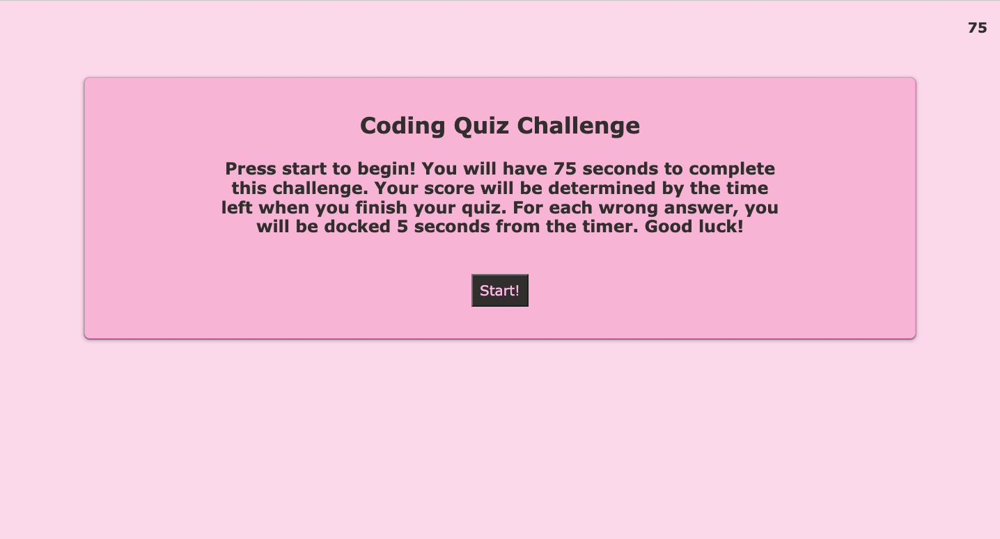
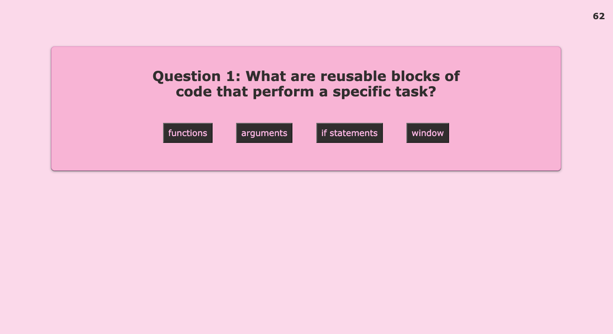
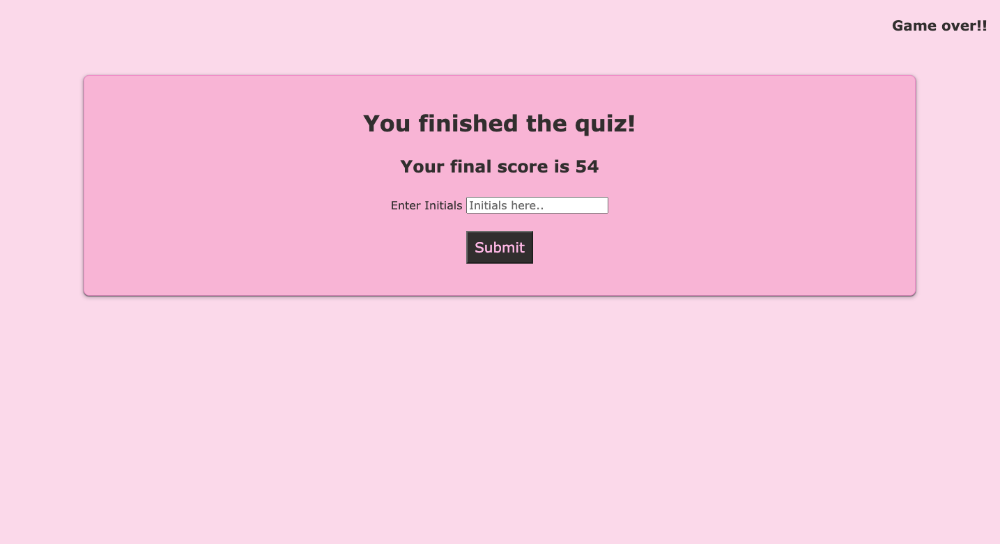
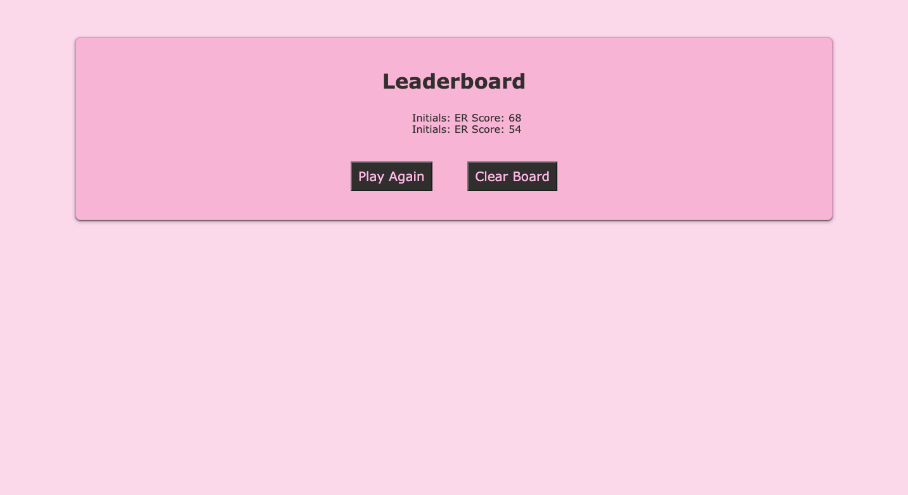

# ultimate-code-quiz

## Description

I created this project because I wanted to make a sample coding quiz that would allow me to test my knowledge through the questions and creating this application. Writing the questions and answers for the quiz was a great study tool for me. Along with this, writing the code for this application from scratch was extremely rewarding and a great learning experience. I learned how to add event listeners and use local storage. I also gained experience using web APIs such as the setInterval() function. At the end of my project, I had created an application with dynamically updated HTML and CSS powered by JavaScript for the first time!

## Usage

[This is the link to the completed application](https://erothman1.github.io/ultimate-code-quiz/)

Here are screenshots to the completed application:

## How to Contribute

For information on how to contribute to this project, please email me at elva.rothman.developer@gmail.com!

